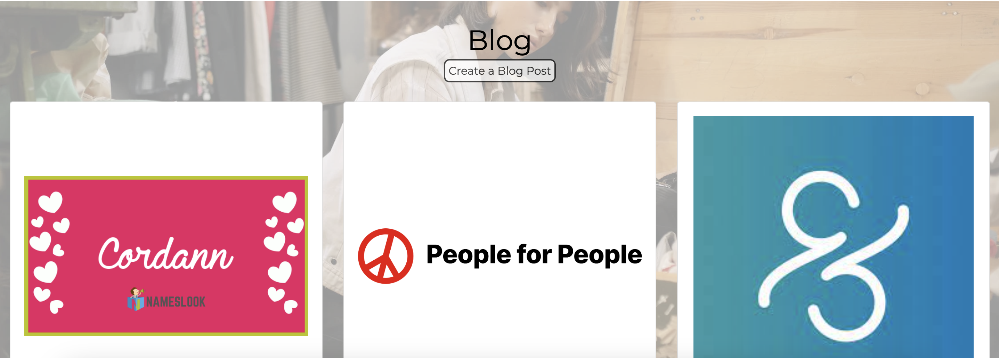
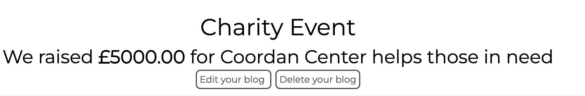
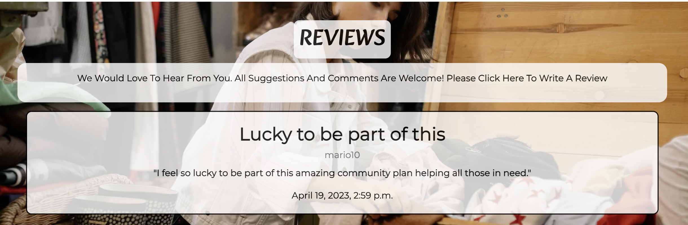
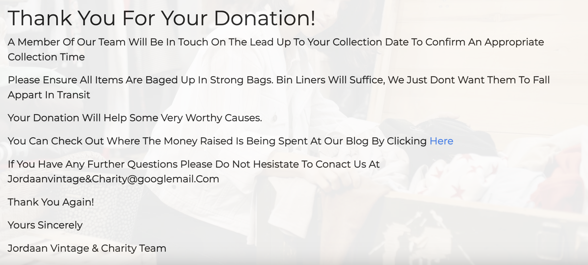
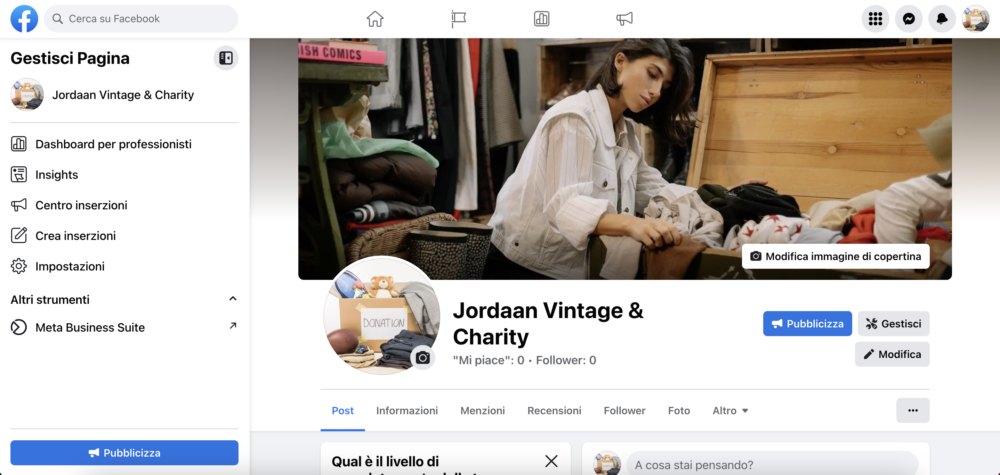
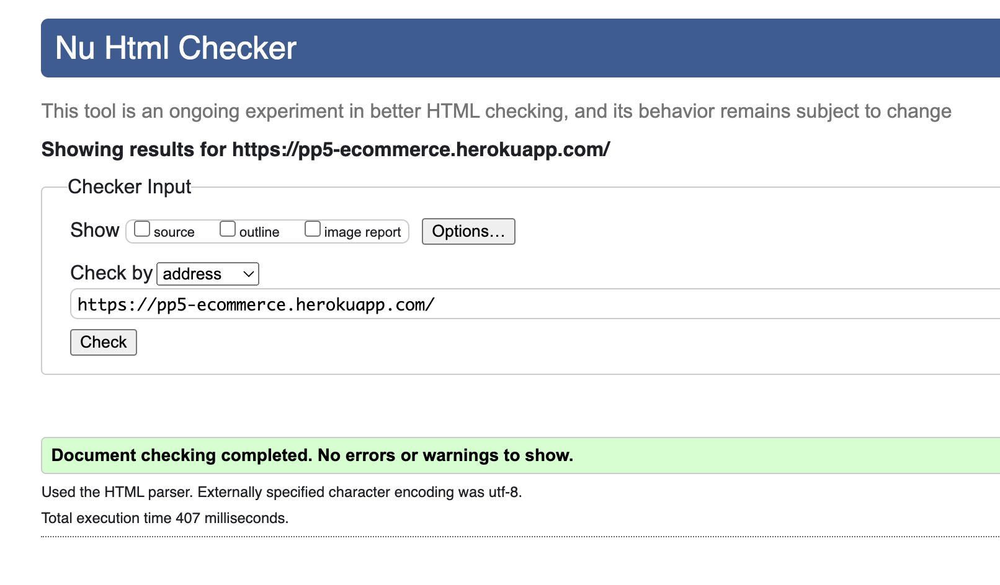
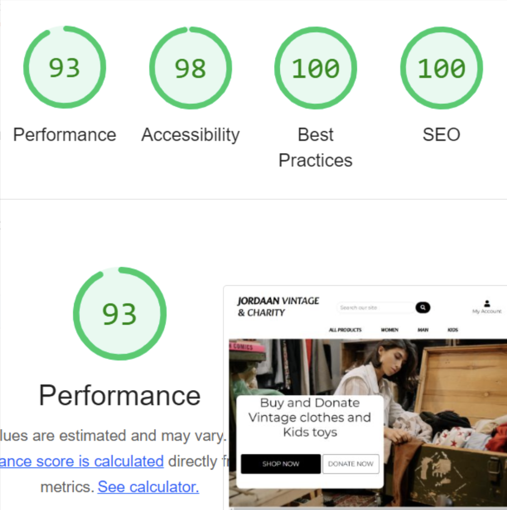

# Jordaan Vintage & Charity

Jordaan Vintage & Charity is a charity ecommerce site.  It takes donations of clothes books and kid’s toys and sells the items online.  It then donates proceeds to charities and charitable events. 

You can reach the live site [here](https://pp5-ecommerce.herokuapp.com/)

# Table of content

- [Laneys Loft](#Joordan Vintage&Charity)
- [Table of contents](#table-of-contents)
- [Business-Model](#business-model)
- [User-Experience-Design](#user-experience-design)
  * [Site Goals](#site-goals)
  * [Agile Planning](#agile-planning)
  * [Scope](#scope)
  * [Structure](#structure)
    + [Laneys Loft Features](#laneys-loft-features)
    + [Home Page](#home-page)
    + [Footer](#footer)
    + [Browse Items](#browse-items)
    + [Item Detail](#item-detail)
    + [Sign in, log in, log out](#sign-in--log-in--log-out)
    + [Shopping Bag](#shopping-bag)
    + [Checkout Page](#checkout-page)
    + [Order Confirmation](#order-confirmation)
    + [Profile Page](#profile-page)
    + [Blog](#blog)
    + [Reviews](#reviews)
    + [Donations](#donations)
    + [Subscribe](#subscribe)
  * [Facebook Page](#facebook-page)
- [Keywords](#keywords)
- [Database](#database)
- [Security](#security)
- [Design](#design)
  * [Colour Scheme](#colour-scheme)
  * [Typography](#typography)
  * [Imagery](#imagery)
- [Technologies](#technologies)
  * [External Python Modules](#external-python-modules)
- [Testing](#testing)
  * [Functional Testing](#functional-testing)
    + [Navigation Links](#navigation-links)
    + [Products page](#products-page)
    + [Product Details page](#product-details-page)
    + [Bag Icon](#bag-icon)
    + [Shopping Bag](#shopping-bag-1)
    + [Checkout](#checkout)
    + [Card Details](#card-details)
    + [Order Confirmation](#order-confirmation-1)
    + [Stripe](#stripe)
    + [Profile Page](#profile-page-1)
    + [Footer](#footer-1)
    + [Blog](#blog-1)
    + [Reviews](#reviews-1)
    + [Donate your preloved items](#donate-your-preloved-items)
    + [Subscribe](#subscribe-1)
    + [Emails](#emails)
  * [Accessibility](#accessibility)
  * [Validator Testing](#validator-testing)
  * [Javascript](#javascript)
  * [Lighthouse Report](#lighthouse-report)
- [Responsiveness](#responsiveness)
- [Bugs](#bugs)
- [Deployment](#deployment)
- [References](#references)
- [Acknowledgements](#acknowledgements)

<small><i><a href='http://ecotrust-canada.github.io/markdown-toc/'>Table of contents generated with markdown-toc</a></i></small>

# Business Model

Jordaan Vintage & Charity is a B2C business.  The business is to take unwanted clothes and kids toys donated by members of the public and sell them online.  All the money are then donated to charitys and charitable events.  We advertise on Facebook and users can share the page to spread the word about us.  We also use the charitys we donate to as advertising because they share us on their websites as well.

## Site Goals

The site is aimed at anyone that wants to donate their unwanted items to charity, and anyone who wants to buy those items.  Without signing in the user can browse the online store and buy and donate their items.  They can also look at the site blog to see the charities that are being helped by the site.  They can log in to see a log of the items they have bought and leave a review of the site.  They can also save their details for future purchases.

## Agile Planning

This project was developed using agile methodologies, delivering small features over 6 sprints spaced out over 6 weeks.The must-have.

My kanban board was made using github projects which can be viewed [here](https://github.com/users/Marittie/projects/7).  Each view can be clicked in to obtain further information.

The user stories were grouped into different Epics

Epic 1 - Set up

The base setup of the Django app was done first as nothing else can be completed before this is done. I completed the base html, and the header. 

Epic 1 user stories

- As a developer, I need to set up the project so that it is ready for implementing core features
- As a developer, I want to create a base HTML page so that all pages can use the same format.
- As a user, I want to be able to navigate around the site easily from any device

Epic 2 - Products and shopping bag

Setting up database model and admin functions and template pages to be able to view the products available to buy and have messages confirming when items have been added to the bag.

Epic 2 User Stories

- As a shopper, I want to view a list of products so that I can select something to buy
- As a shopper, I want to be able to click into a product to view its details so I can see what size it is etc
- As a user, I want to be able to view what I have added to my shopping bag and the total price
- As a user, I want to be able to delete items from my bag when I decide I no longer want something.
- As a user I want to receive a confirmation when I have made changes ie, adding and removing items to my bag so that I know when a change has been completed.

Epic 3 - payment and purchase confirmation emails.

Epic 3 User Stories

- As a shopper, I want to be able to easily enter my payment details so that I can purchase my chosen items.
- As a shopper, I want to see confirmation that my payment has gone through successfully and that my purchase is being sent to the correct address so that I know it has been done correctly
- As a shopper I want Jordaan Vintage & Charity to send me an email so that I can keep confirmation of purchase for my own records.

Epic 4 Allauth
User Stories
- As a new user, I want to be able to sign up easily and intuitively
- As a returning user, I want to be able to log in easily.
- As a user, I want to be able to log out of the site safely and easily.
- As a developer, I want to ensure the forms are all the same style and look good on all devices
- As a developer I want accounts to be secure with email confirmation 

Epic 5 - Profile Page
 - As a user, I want to be able to access a profile page so that I can see my order details
 - As a user, I want to see what donations I have made in the past
 - As a user, I want to be able to update my details if I move house.

Epic 6 - Blog

- As a site user I want to be able to see where the money from the site is being sent so I can feel good about my purchases
- As a site owner I want to easily be able to add blog entries onto the Site
- As a site owner I want to be able to edit my blog posts so that I can make corrections easily
- As a site owner I want to be able to delete blog posts as necessary.
- As a site owner I want to be the only one who can create edit and delete blog posts

Epic 7 - Reviews

Epic 7 User Stories

- As a user, I would like to be able to read reviews about the site so I can decide if I want to use it
- As a site user who is logged in, I would like to be able to leave my own review so that I can tell others about my experience
- As a user, it would be nice to give my review a rating out of five for ease of reference
- As a site owner it would be nice to be able to reply to reviews to show a personal touch

Epic 8 Donations

- As a user, I want to be able to arrange for my donated items to be picked up easily.
- As a user, I want confirmation that my collection form has been received
- As a use,r I want email confirmation with my collection details.

Epic 9 Footer

Epic 9 User Stories

- As the site owner, I want to share social media links and contact details
- As the site owner, I want a nav bar for the site extras such as the blog, reviews and subscribe pages

Epic 10 - Documentation and styling

Epic 10 Tasks

- Complete Styling on all pages and all screen sizes
- Complete Readme documentation
- Complete testing and writeup

## Scope
- Responsive Design
- Home page with information about Jordaan Vintage & Charity
- Ability to perform CRUD functionality on the Blog
- Restricted features for not logged in as users and superusers

## Structure

### Jordaan Vintage & Charity Features

Navbar

user story - As a user, I want to be able to navigate easily around the site from any device

Navigation Menu

from the main top navigation bar, the user can log in or sign in.  Once logged in they can access their profile page.

They can browse all the site products and check their shopping bag.  They can also search the site using the search bar.

on mobile devices the shopping navigation collapses into a dropdown square and the search bar drops down to a magnifying glass search icon

### Home Page

- User Story - As a user I want the front page to be clear and self-explanatory so I know I am in the right place

The front page contains an image of a charity shop.  This gives the initial impression of pre-loved goods.

The front page also contains a tagline advising the user they can shop or donate with a button to take them to either place on the website.  This gives an immediate idea of what the website is for.

Under this is information about the site and how to shop or donate.

### Footer

- User Story: As the site owner, I want to share social media links and contact details
- User Story: As the site owner I want a nav bar for the site extras such as the blog, reviews and subscribe pages

The Footer has been added to the bottom of the site and contains links to the site’s blog, reviews and donations form.  Users can also subscribe to the site’s newsletter from here.

underneath the footer navigation bar users can see the contact email for the site and links to the social media pages.

### Browse Items

- User Story: As a shopper, I want to view a list of products so that I can select something to buy

Users can easily brows items to buy, products come up in rows of 4 on the larges screen and they reduce down to 3,2 then 1 depending on screen size. 

Users can also search by women’s, men’s and kids’ items. They can also pick from a dropdown list of different clothing types to refine their search further.

Users can also search by price.  They can also search for specific words in the search bar at the top of the page

### Item Detail 

- As a shopper, I want to be able to click into a product to view its details so I can see what size it is etc

Users can select to see more detail about an item by clicking on the picture.  This takes them to a detail page where they can then add it to their basket if they wish

### Sign in, log in, log out

- As a new user, I want to be able to sign up easily and intuitively
- As a returning user, I want to be able to log in easily.
- As a user, I want to be able to log out of the site safely and easily.
- As a developer, I want to ensure the forms are all the same style and look good on all devices

  

The sign-in, log-in, log-out pages were made using allauth.
They all have a white background with round corner buttons and input boxes.
This creates continuity within the authorisation section of the site.  I have made them on a white background rather than grey so that they are slightly different from the other ones on the site but they still keep the font style for the title to connect them with the test of the site.

The user will receive a toast message saying they have successfully signed in and out.

 

### Shopping Bag

User Stories
- As a user, I want to be able to view what I have added to my shopping bag and the total price
- As a user, I want to be able to delete items from my bag when I decide I no longer want something.
- As a user I want to receive a confirmation when I have made changes i.e., adding and removing items to my bag so that I know when a change has been completed.

The shopping bag shows a picture of the item(s) in the bag along with the item name, price, quantity (although it is only ever one because there is only one of each item) and the price.  There is also a delete button so items can be deleted easily.

When items are added or deleted from the basked a success message appears that contains the bag content and a link to the checkout page.

 

### Checkout Page

User Stories
- As a shopper, I want to be able to easily enter my payment details so that I can purchase my chosen items easily.

The checkout page has an easy-to-complete form that takes the user’s name, address and card details. It also has a summary of the purchase to confirm what is being bought.

It also has a tick box to save the details to the profile page so it will be prefilled the next time they buy something.

Despite the rest of the boxes on the site having rounded edges, I decided to keep the checkout boxes with sharp edges.  This is because it feels like a more important/trustworthy shape for an important transaction.

### Order Confirmation 

- As a shopper, I want to see confirmation that my payment has gone through successfully and that my purchase is being sent to the correct address so that I know it has been done correctly
- As a shopper I want laneys loft to send me an email so that I can keep confirmation of purchase for my own records.

Once the order has been processed a confirmation page tells the user the order details.  It also advises an email has been sent to the email address provided.

### Profile Page

 - As a user, I want to be able to access a profile page so that I can update my orders
 - As a user, I want to be able to update my details if I move house.

The profile page has the user’s address details available to edit if necessary.  It also has a record of all past shopping orders.

### Blog
User stories:
- As a site user I want to be able to see where the money from the site is being sent so I can feel good about my purchases

The blog page shows a list of blog posts that have been entered by the site owner. 

The create edit and delete a blog post buttons are only visible to the superuser

- As a site owner I want to be the only one who can create edit and delete blog posts

The blog forms are all simple to use with clear instructions.

- As a site owner I want to easily be able to add blog entries to the Site
- As a site owner I want to be able to edit my blog posts so that I can make corrections easily
- As a site owner I want to be able to delete blog posts as necessary.

### Reviews
- As a user, I would like to be able to read reviews about the site so I can decide if I want to use it

The reviews page lists the customer reviews in order of the most recent first.  They are clear and easy to read.

- As a site user who is logged in I would like to be able to leave my own review so that I can tell others about my experience

Everyone can see the write a review button so that users are encouraged to write a review.  However, if you are not logged in, it directs you to the registration page.

### Donations

- As a user, I want to be able to arrange for my donated items to be picked up easily.

The donations form is simple to complete.  The user doesn't need to be logged in to arrange a collection.  They can just complete the form with the address details of the collection date and what and how many bags are to be collected.

The user is then directed to a confirmation screen.

### Subscribe

Users can subscribe to the site’s mailing list.  Mailchimp has been used to set up the mailing list and all the user needs to do is fill out their name and email address.

## Facebook Page

I set up my company’s Facebook page and added the link to the Facebook icon in the footer.

Here is a screenshot of my page

# Keywords

The keywords I thought of for this site were:
- Charity
- Charity Shop
- Donating
- Second hand clothes
- Second hand

I tried to use as many of these as I could around the site.  I added the about Laneys Loft section on the front page and added as many as I could fit into it. I also used a few in the blog section.

# Database

The database was designed for the items to be tracked all the way through to sale and then recorded onto the user profile once sold.

# Security

If statements were used to ensure that buttons that were only for the superuser were hidden from everyone else. The UserPassesTest Mixin was used to make sure the superuser is signed in to complete the blog. And to ensure that the create, edit and delete forms cannot be reached via the url.

Environment variables were stored in an env.py file for security purposes to ensure no secret keys, api keys or sensitive information were added to the repository.  These variables were added to Heroku config vars within the project

# Design

## Colour Scheme

I opted for a simple black and white colour scheme.  I wanted the site to look clean and simple in its design

## Typography

I used Alkatra for the logo font and Montserrat for the body of the site

I downloaded these from google fonts and imported them into the style sheet

## Imagery  

The front page image was taken from google searching for vintage shops.
The item pictures are either the ones used in in the Boutique Ado project.

# Technologies

- HTML
  - The structure of the site was made using HTML
- CSS
  - The website was styled using CSS in an external stylesheet 
- Python 
  - Python was the main programming language used within the django app
- Github
  - Source code was hosted in Github
- Git
  - Git was used to write, commit and push code during development 
- Font Awesome
  - Various Font Awesome icons were used throughout the site
- Balsamiq
  - Balsamiq wireframes were used to plan 
- javascript
  - Used throughout the site
- [GitHub Wiki TOC generator](http://ecotrust-canada.github.io/markdown-toc/)
  - I used this to enter my table of contents.
-AWS Amazon
  - Used to store pictures
-Stripe
  - I used stripe payment system

  ## External Python Modules

- asgiref==3.6.0
- boto3==1.26.111
- botocore==1.29.111
- dj-database-url==0.5.0
- Django==3.2
- django-allauth==0.41.0
- django-countries==7.2.1
- django-crispy-forms==1.14.0
- django-storages==1.13.2
- django-summernote==0.8.20.0
- gunicorn==20.1.0
- jmespath==1.0.1
- oauthlib==3.2.2
- Pillow==9.4.0
- psycopg2==2.9.6
- python3-openid==3.2.0
- pytz==2022.7.1
- requests-oauthlib==1.3.1
- s3transfer==0.6.0
- sqlparse==0.4.3
- stripe==5.3.0

# Testing

## Functional Testing

### Navigation Links

Testing was performed on on all navigation links throughout the site.  I achieved this by clicking on each link to ensure it went to the correct place.

Laneys Loft Logo => index.html

All Products
- By Price => Arranges products by price
- By Category => Arranges products by A-Z Category
- All Products => Shows all products

Women’s

Skits, Jeans, Tops, T-shirts and All clothing
- All these filter women’s cloths by the desired clothing type

Men’s 

clothes all filtered by the correct clothing types

Kids’ clothes and toys all filter by the correct types

My Account

My Profile => Profile page

Log out (if logged in) => to log out page

(if not logged in) Sign in => to sign in page

(if not logged in) Register => to Registration page

### Products page
Picture => Product detail page

Sort Box => All items in the sort box were tested and sort items accordingly

### Product Details page
Keep Shopping => goes back to the products page

Add to bag => correctly adds the item to the user’s bag this shows a success toast with the bag contents and the bag total cost shows up under the shopping bag icon.  

The user can either click the cross on the toast to get rid of it or they can go to the checkout by clicking the go to secure checkout button.  This works correctly

I tested adding the same item twice to the shopping bag and an error message correctly appears advising the user they can’t do that.

### Bag Icon
The shopping bag icon takes the user to the shopping bag.

### Shopping Bag
The red remove button correctly deletes the item from the shopping bag and the correct toast appears to confirm this has been successful.

The Keep Shopping button correctly takes the user back to the products page

The Secure checkout button correctly takes the user to the checkout form.

### Checkout

I checked the checkout form for positive and negative tests

I left each box blank and the form flagged an error when these were not filled in correctly.
The email box flagged an error when an incorrect email address was input.  I tried it with just letters and with only an @, and with only a .com.  These all showed errors as expected.

I tested The save delivery information button to the profile button both ticked and unticked and it correctly saved the forms information when the box was ticked.  I then logged in again to check that the information was in the form the next time and it was.

The adjust bag button correctly takes the user back to the bag.

### Card Details
I used stripes test card number to use on the site.  It showed an error when the card number was input incorrectly

### Order Confirmation

The order confirmation button takes the user to a thank you page confirming their email address, address and order details.
A success message also correctly appears supplying the order number and confirming the confirmation email is sent to the email address given.

I checked the latest deals button takes the user back to the products page.

Once the item has been bought, it correctly no longer appears on the products page to be bought again.  As this is a second hand site there is only one of each item.

### Stripe
I checked the stripe website to make sure that the payment had gone through correctly there and the webhooks had worked correctly and all was working well.

### Profile Page
I checked that the order had correctly been added to the profile page

I also updated the customer details which the

### Footer
### Blog
The blog button correctly takes the user to the blog list page, each blog post photo and title correctly take the user to the blog detail page for that post.

On the blog post, only the superuser can see the create blog post button.  I tested this both logged out completely and logging in as a regular user.
The same applies to the delete and edit buttons located in the blog detail.

I also used the URL to try and get to the create, edit and delete pages without the buttons and you could get there as the superuser but could not as either not logged in or logged in as a different user.

### Reviews
The reviews button correctly takes the user to the reviews page, the reviews are correctly ordered with the newest first.
The write a review button takes you to the form to write your review.  once completed the submit button correctly takes you back to the review page where the new review is visible.

### Donate your clothes and toys
This button correctly takes you to the form to be completed to get your items collected.
I tested this form and all of the stared fields did need to be entered in order for the form to be sent.

### Subscribe
The subscribe button correctly takes the user to the mailchimp subscription page.

### Emails

I was correctly able to set up a new user, receive an email to confirm the email address of the user, click the link to the site and confirm the email address.
I then logged in with an incorrect name and email for the user and both flagged errors correctly by the system. 

A confirmation email was correctly sent once an order was completed.

## Accessibility

I used the [Wave Accessibility](https://wave.webaim.org/)tool to check for aid accessibility testing.

## Validator Testing

All pages were run through the [w3 HTML validator](https://validator.w3.org/).

## Javascript
I didn't use any Javascript in this project over the js used in boutique ado so I have not tested for that.

## Lighthouse Report

# Responsiveness

I checked the website for responsiveness on all devices from 320px and up.  I checked on Chrome, Edge, Firefox and Opera browsers.

I did this by using developer tools and re-sizing the website to down to 320px.

As expected, there were no responsiveness issues.

# Bugs

No bugs detected.

# Deployment

To deploy my site to Heroku I followed the following steps

- Navigate to heroku and create/log into account
- Click the new button in the top right corner
- Select create new app
- Enter app name
- Select region and click create app (europe)
- Click the resources tab and search for Heroku Postgres
- Select hobby dev and continue
- Go to the settings tab and then click reveal config vars
- Make sure the correct config bars are added
  - AWS_ACCESS_KEY_ID (for access to AWS)
  - AWS_SECRET_ACCESS_KEY (for access to AWS)
  - SECRET_KEY: (Your secret key)
  - DATABASE_URL: (This should already exist with add on of postgres)
  - EMAIL_HOST_USER: (email address)
  - EMAIL_HOST_PASS: (email app password)
  - STRIPE_PUBLIC_KEY (Stripes public key)
  - STRIPE_SECRET_KEY (Stripes secret key)
  - STRIPE_WH_SECRET (Stripes Web Hook secret key)
  - USE_AWS (set to True to use AWS)
- Click the deploy tab
- Scroll down to Connect to GitHub and sign in / authorize when prompted
- In the search box, find the repository you want to deploy and click connect
- Scroll down to Manual deploy and choose the main branch
- Click Deploy

The app should now be deployed

# References
- I used the django documentation 
- I used the bootstrap documentation
- I used slack overflow
- I used CI slack community
- I followed the Boutique Ado walkthrough and used it as a base for the site.

# Acknowledgements

I want to thank:
- The wonderful slack community

